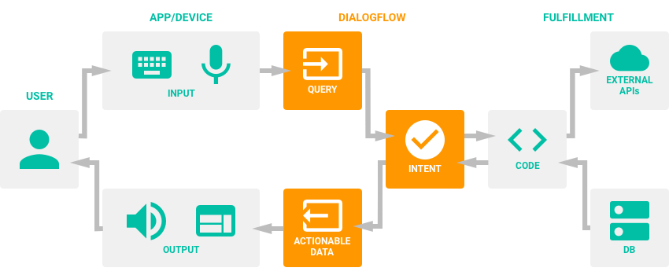
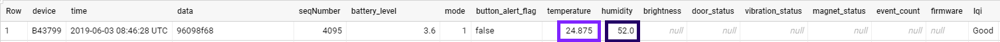
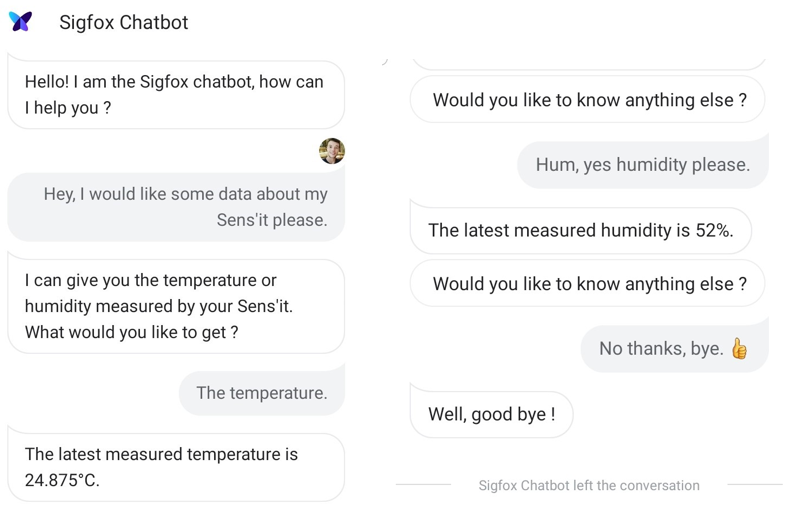

# Accessing Sigfox data through Dialogflow

## Introduction

Since February 2019, Google Cloud Platform and Sigfox Backend can be officialy integrated. Basically, it means that it is now possible to push the data generated from Sigfox enabled devices up to Google Cloud Platform. 

This article presents how to leverage on this integration by giving users new ways to interact with this data such as voice apps and chatbots, powered by AI. This, on several and heterogenous platforms like your own website, mobile app, the Google Assistant, Amazon Alexa, Facebook Messenger, and many others..

Here the goal is show how the data measured by a [Sens'it](https://build.sigfox.com/sensit-for-developers) can be exposed via Dialogflow.


Regarding the previous integration, you can check the related tutorials: [Integrating Sigfox IoT network with Google Cloud Platform](https://cloud.google.com/community/tutorials/sigfox-gw) and [Using Sigfox Sens'it with GCP](https://cloud.google.com/community/tutorials/sigfox-sensit). All credits to
[Markku Lepisto](https://github.com/lepistom).

## Dialogflow Implementation

Dialogflow is a Google-owned interface of human–computer interaction that allow to recognize sentences sent by the user and select appropriate *actions* based on configuration and machine learning. 

### Sigfox Agent

In Dialogflow, the basic stream of a conversation involves these steps:

    - The user gives inputs
    - Your Dialogflow agent parses those inputs
    - Your agent returns a response to the user

To define how conversations work, it is needed to create **intents** within the agent that map user inputs to responses.
When defining a new agent, you will get by default the **Default Welcome intent** and the **Default Fallback Intent**.

So, we need to create the **Sigfox Intent** that will handle requests about Sigfox.

### Sigfox Intent Configuration

Intent configuration is well explained in many articles. Feel free to check these out, for instance [here](https://medium.com/swlh/chapter-8-how-to-build-a-google-home-app-with-dialogflow-environment-setup-3547993e99a4).
In this example, I have configured the Sigfox intent to ask the user to choose a data type between *temperature* and *humidity*. This parameter will be used then to filter the answer.

### Fulfillment

Dialogflow allows to write code that will be triggered at a certain moment during the Intent processing. This is called **Fulfillment**. Here below is an overview of how it works:

That said, it means that the last thing that has to be done is to write the portion of code that will request the data to Google BigQuery, filter it and finally deliver it to our Sigfox Intent.

#### Constants definition

Like in every project, constants are needed. Here they are:

```javascript
'use strict';

const functions = require('firebase-functions');
const { WebhookClient } = require('dialogflow-fulfillment');
const BIGQUERY = require('@google-cloud/bigquery');
const SIGFOX_INTENT = 'Sigfox Intent';
const DATA_TYPE_ENTITY = 'DataType';
const BIGQUERY_CLIENT = new BIGQUERY();

process.env.DEBUG = 'dialogflow:debug';
```

#### Implement the function that will query GCP

1. The fulfillment will query BigQuery database and select the last line based on the [*Sequence Number*](https://support.sigfox.com/docs/sequence-number:-general-knowledge).
Make sure to fill in the query parameters with your Google Cloud Platform information.

2. Depending on which data type has been chosen by the user, fulfillment will filter the corresponding field (ie temperature or humidity).

3. Fulfillment will deliver the answer to the Sigfox Intent.

```javascript
function getDataFromBigQuery(agent) {
        const OPTIONS = {
            query: 'SELECT * FROM `[your_google_cloud_platform_project_name].[your_pubsub_topic_name].[your_table_name]` ORDER BY seqNumber DESC LIMIT 1',
            timeoutMs: 10000,
            useLegacySql: false
        };
        return BIGQUERY_CLIENT.query(OPTIONS).then(results => {
            console.log(JSON.stringify(results[0]));
            const ROWS = results[0];
            const data_type = agent.parameters[DATA_TYPE_ENTITY].toLowerCase();
            if (data_type == "temperature") {
                const temperatureResult = JSON.stringify(ROWS[0].temperature);
                agent.add('The latest measured temperature is ' + temperatureResult + '°C.');
            } else if (data_type == "humidity") {
                const humidityResult = JSON.stringify(ROWS[0].humidity);
                agent.add('The latest measured humidity is ' + humidityResult + '%.');
            } else {
                agent.add("Sorry I did not understand your request.");
            }
          	agent.add(" Would you like to know anything else ?");
        })
            .catch(err => {
                console.error('ERROR:', err);
            });
    }
```

#### Implement fulfillment base block

This is the base block implemented to map the Sigfox Intent and the method triggering.  

```javascript
exports.dialogflowFirebaseFulfillment = functions.https.onRequest((request, response) => {
    const agent = new WebhookClient({ request, response });
    let intentMap = new Map();
    intentMap.set(SIGFOX_INTENT, getDataFromBigQuery);
    agent.handleRequest(intentMap);
});
```

You can find the complete code in this GitHub repository.

## Integration 

The app can now be integrated with several platforms and interfaces. [Here](https://medium.com/heptagon/chapter-12-how-to-build-a-google-home-app-with-dialogflow-app-deployment-9596bd74d9ad) you can find some information on how to do it. 

## Results

Here below is the last row of my Sens'it BigQuery table:



And here are some screenshots of the Sigfox chatbot conversation:

 
